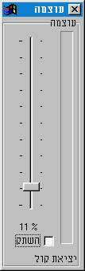



## Volume Meter \(Hebrew\)

### Description

This code is a Volume-Meter example.

it has a volume-meter and slider to control the sound volume of the computer, you can change the sound volume in your computer.

By the way the volume-meter has bitmap picture so you can draw your own picture and change the picture of the volume-meter.

Please send me own drawing pictures to my Email at: uriabudi@zahav.net.il.
 
### More Info
 

             |
---                |---
**Submitted On**   |2002-02-07 17:18:50
**By**             |[Eliran Abudi](https://github.com/Planet-Source-Code/PSCIndex/blob/master/ByAuthor/eliran-abudi.md)
**Level**          |Intermediate
**User Rating**    |4.8 (19 globes from 4 users)
**Compatibility**  |VB 6\.0
**Category**       |[Sound/MP3](https://github.com/Planet-Source-Code/PSCIndex/blob/master/ByCategory/sound-mp3__1-45.md)
**World**          |[Visual Basic](https://github.com/Planet-Source-Code/PSCIndex/blob/master/ByWorld/visual-basic.md)
**Archive File**   |[Volume\_Met68338432002\.zip](https://github.com/Planet-Source-Code/eliran-abudi-volume-meter-hebrew__1-33392/archive/master.zip)

